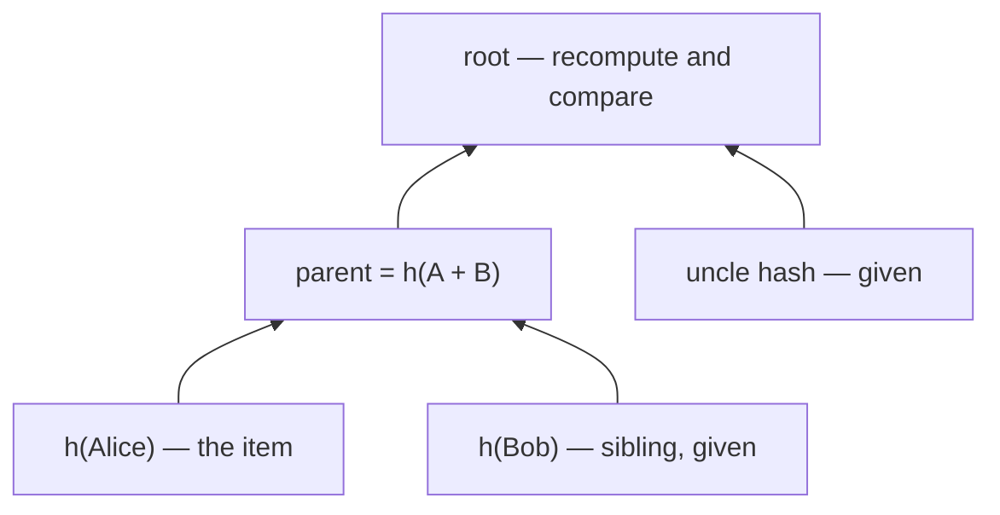

In the [last post](./merkle-trees) I built a Merkle tree and got its root a single hash standing in for a whole set of data. The root is a blunt instrument, though. It proves the set as a whole. The question you usually actually want answered is narrower: *is this one item in the tree?*  and ideally without me handing you the entire thing to check. That's what a **Merkle proof** is for.

## What a proof actually is

A proof is the shortest set of hashes that lets you climb from one leaf back up to the root. At each level you don't need the whole row you only need the *sibling* of the node you're holding, because that's the one missing piece you'd combine with to compute the parent. Collect one sibling per level, and you can recompute the root yourself.



The thing worth noticing in that diagram: to verify Alice, you're handed two hashes her sibling and the uncle — and you compute the rest. For a tree of a million leaves, a proof is about twenty hashes. That's the magic: verification cost grows with the *height* of the tree, not its size.

## Building the tree, keeping the levels

To generate proofs I need to remember the tree, not just the root so this version stores each level as it's built. I also pulled the hashing into a small lambda to stop repeating myself.

```python
class MerkleTree:
    def __init__(self, data):
        self.leaves = data
        self.root = None
        self.tree = []

        self.hash_function = lambda x: hashlib.sha256(json.dumps(x, sort_keys=True).encode()).hexdigest()
        

    def build(self):
        if len(self.leaves) == 1:
            self.root = self.leaves[0]
            self.tree.append([self.root])
            return

        if len(self.leaves) % 2 != 0:
            self.leaves.append(self.leaves[-1])

        self.leaves = [
            self.hash_function(leaf)
            for leaf in self.leaves
        ]

        self.tree.append(self.leaves)

        while len(self.leaves) > 1:
            if len(self.leaves) % 2 != 0:
                self.leaves.append(self.leaves[-1])

            self.leaves = [
                self.hash_function(self.leaves[i] + self.leaves[i + 1])
                for i in range(0, len(self.leaves), 2)
            ]

            self.tree.append(self.leaves)

        self.root = self.leaves[0]

    def get_root(self):
        if self.root is None:
            self.build()
        return self.root
```

## Generating the proof

Find the item on the bottom row, then walk up. At each level, grab the sibling and note which side it's on, left or right matters because hashing isn't commutative and `h(a + b)` is not `h(b + a)`. Dividing the index by two each step moves you to the parent.

```python
class MerkleTree:
    ...
    
    def generate_proof(self, target):
        if self.root is None:
            self.build()
        
        target_hash = self.hash_function(target)
        proof = []

        idx = self.tree[0].index(target_hash)

        for level in range(len(self.tree) - 1):
            sibling_idx = idx + 1 if idx % 2 == 0 else idx - 1
            sibling_hash = self.tree[level][sibling_idx]
            proof.append((sibling_hash, idx % 2 == 1))
            idx //= 2

        return proof
```

## Verifying it

Verification is the proof in reverse: start from the item's hash, and at each step combine it with the proof hash *on the correct side*, until you've rebuilt a root. If it matches the root you were given, the item is genuinely in the tree.

```python
def verify_proof(self, proof, target, root):
    computed_hash = self.hash_function(target)
    for proof_hash, is_left in proof:
        if is_left:
            computed_hash = self.hash_function(proof_hash + computed_hash)
        else:
            computed_hash = self.hash_function(computed_hash + proof_hash)
    return computed_hash == root
```
### Example: 

```python
data = ['Alice', 'Bob', 'Charlie', 'Dave', 'Eve']
tree = MerkleTree(data)
root = tree.get_root()
print("Merkle Root:", root)

target = 'Alice'
proof = tree.generate_proof(target)
print("Proof for Alice:", proof)

is_valid = tree.verify_proof(proof, target, root)
print("Is the proof valid?", is_valid)  # True
```

## Resources

- [Merkle Tree (Wikipedia)](https://en.wikipedia.org/wiki/Merkle_tree)
- [Merkle Proofs Explained](https://medium.com/crypto-0-nite/merkle-proofs-explained-6dd429623dc5)
- [Verifiable Data Structures: Merkle Trees and Logs](https://transparency.dev/verifiable-data-structures/#verifiable-log)
