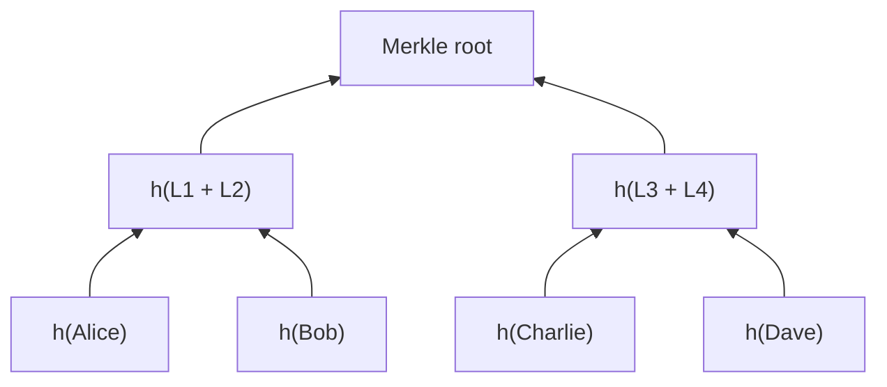

I was building a toy blockchain by following [Learning Blockchains by Building One](https://hackernoon.com/learn-blockchains-by-building-one-117428612f46), and I hit the part where a block has to prove its transactions haven't been quietly edited. The standard answer is a Merkle tree. So I built one from scratch in Python, proud of this because the concept appears simple once you understand it. 

## What a Merkle tree actually is

It's a binary tree built entirely out of hashes. Hash each piece of data into a leaf, hash each pair of leaves into a parent, hash pairs of parents, and keep climbing until one hash is left at the top: the **Merkle root**.



That single root is a fingerprint of everything beneath it. Change one character in one leaf and the root changes completely. That's the entire point: a block can carry one 64-character root in its header instead of every transaction, and anyone can still check a transaction against it.

So instead of a block hauling around this:

```json
{
  "transactions": [
    { "sender": "Alice", "recipient": "Bob", "amount": 50 },
    { "sender": "Bob", "recipient": "Alice", "amount": 25 }
    ...
  ]
}
```

it carries this:

```json
{
  "transactions": "0x1234567890abcdef"
}
```

and the tree is what lets you prove any single transaction belongs to that hash.

## Building it

Python, with `hashlib` for SHA-256 and `json` to serialise the data before hashing.

```python
import hashlib
import json

class MerkleTree:
    def __init__(self, data):
        self.leaves = data
        self.root = None
```

The first wrinkle is that trees want even numbers. If a level has an odd number of nodes, I duplicate the last one so it has something to pair with.

```python
def build(self):
    if len(self.leaves) == 1:
        self.root = self.leaves[0]
        return 

    if len(self.leaves) % 2 != 0:
        self.leaves.append(self.leaves[-1])
```

Then hash every leaf. I serialise with `sort_keys=True` so the same data always hashes to the same value without that, dictionary ordering could quietly change the root.

```python
def build(self):
    if len(self.leaves) == 1:
        self.root = self.leaves[0]
        return 

    if len(self.leaves) % 2 != 0:
        self.leaves.append(self.leaves[-1])

    self.leaves = [
        hashlib.sha256(json.dumps(leaf, sort_keys=True).encode()).hexdigest() 
        for leaf in self.leaves
    ]
```

Then the recursive part: pair adjacent hashes, concatenate and hash each pair, and call `build` again on the shorter list. Each call halves the number of nodes until one is left. This loop is uglier than it needs to be but it works, and it taught me the structure better than a tidy version would have.

```python
def build(self):
    ...
    self.leaves = [
        self.leaves[i:i + 2] for i in range(0, len(self.leaves), 2)
    ]

    self.leaves = [
        hashlib.sha256((self.leaves[0][0] + self.leaves[0][1]).encode()).hexdigest()
        if len(self.leaves[0]) == 2 else self.leaves[0][0]
        for self.leaves[0] in self.leaves
    ]

    self.build()
```

Getting the root just builds the tree first if it hasn't been built yet:

```python
def get_root(self):
    if self.root is None:
        self.build()
    return self.root
```

And a quick test with five names note the odd count, which is exactly the duplicate-the-last case from above:

```python
data = ['Alice', 'Bob', 'Charlie', 'Dave', 'Eve']
tree = MerkleTree(data)
print(tree.get_root())
```

## Why the shape matters

One root hash now stands in for the whole set. Tamper with any leaf and the root won't match that's what makes a block tamper-evident. And because the tree keeps the intermediate hashes around, you can prove a single item belongs to the set without handing someone the entire thing. That proof is the next piece, and it's where Merkle trees stop being a neat data structure and start being genuinely useful.

## Resources

- [Merkle Tree (Wikipedia)](https://en.wikipedia.org/wiki/Merkle_tree)
- [Learning Blockchains by Building One](https://hackernoon.com/learn-blockchains-by-building-one-117428612f46)
