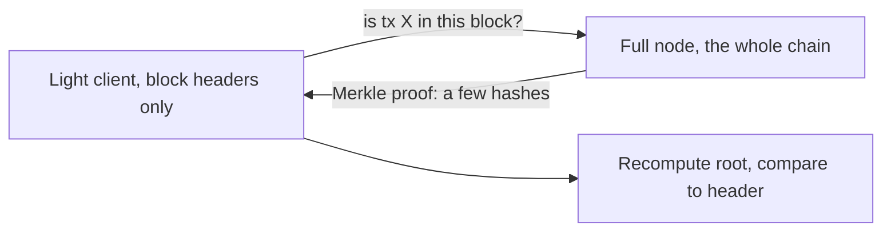

I [built a Merkle tree](./merkle-trees) and [generated proofs](./generating-merkle-proofs) from scratch, which is satisfying but a bit abstract. The reason any of it matters is that the same trick (verify one item against a single root hash, using a number of hashes that grows with the *height* of the tree, not its size) is doing real work underneath systems you use. Here's where, and why it's the right tool each time.

## Bitcoin: verifying a payment without the whole chain

Every Bitcoin block builds a Merkle tree from its transactions and puts only the root in the block header. That one design choice is what makes **SPV**  Simplified Payment Verification possible.

A full node stores the entire chain, which is hundreds of gigabytes. Your phone wallet can't and shouldn't. So instead it keeps only the small block headers, and when it needs to confirm a payment landed, it asks a full node for a Merkle proof: the handful of sibling hashes linking that transaction to a root it already trusts.

The wallet recomputes the root from the proof and checks it against the header it's holding. A few hashes instead of 500 gigabytes. The phone never has to trust the full node's *answer* it verifies the maths itself.

## Ethereum: proving state, not just transactions

Ethereum needs more than "was this transaction included." It needs to prove things about the current *state* of the world an account's balance, a contract's stored data. So it uses a beefier cousin of the Merkle tree, the **Merkle Patricia Trie**, and every block commits to a state root the same way Bitcoin commits to a transaction root.

The payoff is the same shape: a light client can ask "what's the balance of this account?" and get back a proof it can verify against the state root, without replaying the entire chain. Same idea, richer structure.

## Distributed storage: verifying a file in pieces

The pattern isn't blockchain-specific. Systems like [IPFS](https://ipfs.io/) split a file into chunks, hash each chunk, and build a Merkle tree over them. The root identifies the whole file; the tree lets you verify each chunk as it arrives.

That means you can download a large file from many untrusted peers at once and check every piece against the root as it lands, so no waiting until the end to find out one peer sent you garbage and content addressing and integrity checking fall out of the same structure for free.

## The thread

Once you've built one, you start seeing the shape everywhere: any time something needs to prove a small fact about a large dataset to a party that can't hold all of it, a Merkle tree is probably the answer. That's why building the toy version was worth it not for the toy, but for recognising the pattern in the wild.

## Resources

- [Merkle Tree (Wikipedia)](https://en.wikipedia.org/wiki/Merkle_tree)
- [Bitcoin Whitepaper](https://bitcoin.org/bitcoin.pdf)
- [Ethereum Whitepaper](https://ethereum.org/en/whitepaper/)
- [IPFS](https://ipfs.io/)
