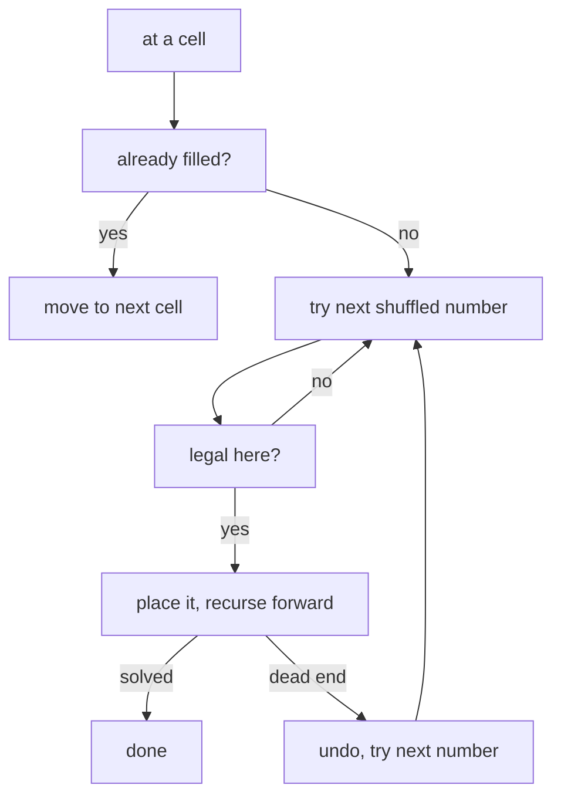

[Last post](./building-interactive-sudoku-game-part-i) I set up the types. Now the board needs an actual puzzle on it, as confusing as it sounded to me at the time **generating a Sudoku is the same problem as solving one.** Fill an empty grid with a valid, complete solution, then take numbers away. The solver does the hard part; "making a puzzle" is just deletion.

## Filling the grid

To fill the board I use backtracking. Walk the grid cell by cell; at each empty cell, try the numbers 1 to 9; if a number is legal there, place it and move on; if you later get stuck, rewind and try the next one. Standard stuff, with one twist that matters.

```typescript
function solveSudoku(board: Board, row = 0, col = 0): boolean {
    if (row === 9) {
        return true;
    }

    if (col === 9) {
        return solveSudoku(board, row + 1, 0);
    }

    if (board[row]?.[col]?.value !== null) {
        return solveSudoku(board, row, col + 1);
    }

    const numbers = shuffle([1, 2, 3, 4, 5, 6, 7, 8, 9]);
    for (const num of numbers) {
        if (isValid(board, row, col, num)) {
            board[row][col].value = num;
            board[row][col].editable = false;
            if (solveSudoku(board, row, col + 1)) {
                return true;
            }
            board[row][col].value = null;
            board[row][col].editable = true;
        }
    }

    return false;
}
```

The twist is `shuffle`. A plain solver tries 1, 2, 3... in order and produces the *same* completed grid every time. Shuffling the candidates at each cell means every run fills the board differently, so you don't play the same game twice. And there's a lot of room to be different: there are [6,670,903,752,021,072,936,960 possible Sudoku grids](https://en.wikipedia.org/wiki/Mathematics_of_Sudoku).



## The one rule, in one function

Every constraint in Sudoku reduces to the same question: can this number go here? `isValid` answers it, and the whole project leans on this one function, generation, and later the win check, all go through it.

```typescript
function isValid(board: Board, row: number, col: number, num: number): boolean {
    // check if the number is already in the row
    for (let i = 0; i < 9; i++) {
        if (board[row]?.[i]?.value === num) {
            return false;
        }
    }

    // check if the number is already in the column
    for (let i = 0; i < 9; i++) {
        if (board[i]?.[col]?.value === num) {
            return false;
        }
    }

    // check if the number is already in the 3x3 box
    const startRow = row - (row % 3);
    const startCol = col - (col % 3);
    for (let i = 0; i < 3; i++) {
        for (let j = 0; j < 3; j++) {
            if (board[i + startRow]?.[j + startCol]?.value === num) {
                return false;
            }
        }
    }

    return true;
}
```

Row, column, box. The only mildly clever line is finding the top-left corner of a cell's 3x3 box with `row - (row % 3)`, which snaps any index back to 0, 3, or 6.

The shuffle itself is a Fisher-Yates, the correct way to randomise an array without bias:

```typescript
const shuffle = (array: number[]) => {
    for (let i = array.length - 1; i > 0; i--) {
        const j = Math.floor(Math.random() * (i + 1));
        [array[i], array[j]] = [array[j]!, array[i]!];
    }
    return array;
}
```

## Punching holes

Now the actual puzzle. Start from a full, valid grid and remove cells. Difficulty is just the fraction of cells you clear, and a cleared cell becomes editable again so the player can fill it.

```typescript
const generateSudokuBoard = (difficulty: number): Board => {
    const board = createBoard();
    solveSudoku(board);

    const totalCells = 81;
    const cellsToRemove = Math.floor(totalCells * difficulty);

    let removedCells = 0;
    while (removedCells < cellsToRemove) {
        const row = Math.floor(Math.random() * 9);
        const col = Math.floor(Math.random() * 9);

        if (board[row]?.[col]?.value !== null && board[row]?.[col]?.value !== undefined) {
            board[row][col].value = null;
            board[row][col].editable = true;
            removedCells++;
        }
    }

    return board;
}
```

On the live site I ship this at `difficulty = 0.65`, which clears about 53 of the 81 cells. That's a hard-looking board, and, as it turns out, a slightly dishonest one.

Next post: wiring all of this into a board you can actually click.