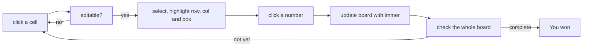

The [generator](./building-interactive-sudoku-game-part-ii) was the hard part. This last post is where the maths becomes a game you can play, a clickable grid in React, with selection, highlighting, number entry, and a win check.

## The board component

The generated board comes in as a prop, and I lift it straight into state so it can change as the player fills cells.

```typescript
const SudokuBoard = ({ generatedBoard }: { generatedBoard: Board }) => {
    const [board, setBoard] = useState<Board>(generatedBoard);
}
```

Rendering is a CSS grid, nine columns, with each cell handed to its own component:

```tsx
<div className="grid grid-cols-9 gap-4 mb-4">
    {board.map((row, rowIndex) =>
        row.map((cell, colIndex) => (
            <Cell
                key={`${rowIndex},${colIndex}`}
                cell={cell}
                onClick={handleCellClick}
                isSelected={!isWon && selectedCell?.row === rowIndex && selectedCell?.col === colIndex}
                highlighted={highlightedCells.has(`${rowIndex},${colIndex}`)}
            />
        ))
    )}
</div>
```

## The cell

The `Cell` is mostly presentation, its whole job is to look right for its current state and only respond to clicks if it's editable.

```tsx
const Cell = ({ cell, onClick, isSelected, highlighted }: { cell: Cell; onClick: (cell: Cell) => void; isSelected: boolean; highlighted: boolean }) => {
    return (
        <div
            className={`w-4 h-4 sm:w-10 sm:h-10 flex items-center justify-center rounded-lg 
            ${isSelected ? 'animate-pulse' : ''} 
            cursor-pointer hover:bg-gray-400 transition-colors 
            ${cell.editable ? 'bg-gray-200' : ''} 
            ${highlighted ? 'bg-sky-200' : ''} 
            ${cell.col === 2 || cell.col === 5 ? 'mr-2' : ''} 
            ${cell.row === 2 || cell.row === 5 ? 'mb-4' : ''}`}
            onClick={() => cell.editable && onClick(cell)}
        >
            {cell.value}
        </div>
    );
};
```

Two honest admissions here. First, those `editable` and `isSelected` flags from part one are finally earning their keep, deciding the background, the pulse, whether a click does anything. Second, look at the last two lines: I fake the 3x3 box separators by sticking a margin on columns 2 and 5 and rows 2 and 5. It's a hack. A "real" version would draw proper borders, but a conditional margin got the visual break for about a tenth of the effort, and on a toy I'll take that trade.

## Selecting and highlighting

Click an editable cell and it either deselects (if it was already selected) or becomes the selection, lighting up its row, column, and box so you can see what constrains it.

```typescript
const handleCellClick = (cell: Cell) => {
    if (!cell.editable) {
        return;
    }

    // Deselect the cell if it's already selected
    if (selectedCell?.row === cell.row && selectedCell?.col === cell.col) {
        setSelectedCell(null);
        setHighlightedCells(new Set());
        return;
    }

    // Select the cell and calculate the highlighted cells
    setSelectedCell(cell);
    setHighlightedCells(calculateHighlightedCells(cell));
};
```

```tsx
const [selectedCell, setSelectedCell] = useState<Cell | null>(null);
const [highlightedCells, setHighlightedCells] = useState<Set<string>>(new Set());
```

The highlighted cells live in a `Set` of `"row,col"` strings, which makes the lookup in the render (`highlightedCells.has(...)`) a flat O(1) instead of scanning a list every frame.

```typescript
const calculateHighlightedCells = (cell: Cell) => {
    const newHighlightedCells = new Set<string>();
    const { row, col } = cell;

    // Highlight row and column
    for (let i = 0; i < 9; i++) {
        newHighlightedCells.add(`${row},${i}`);
        newHighlightedCells.add(`${i},${col}`);
    }

    // Highlight 3x3 grid
    const startRow = Math.floor(row / 3) * 3;
    const startCol = Math.floor(col / 3) * 3;
    for (let r = startRow; r < startRow + 3; r++) {
        for (let c = startCol; c < startCol + 3; c++) {
            newHighlightedCells.add(`${r},${c}`);
        }
    }

    return newHighlightedCells;
};
```

## Entering a number

A number click writes into the selected cell. The only thing worth pausing on is `produce` from [immer](https://immerjs.github.io/immer/), which lets me write the update as if I'm mutating the board while still handing React a brand-new object so it re-renders cleanly.

```typescript
const handleNumberClick = (value: number) => {
    if (selectedCell) {
        const { row, col } = selectedCell;
        setBoard((prevBoard) => {
            const newBoard: Board = produce(prevBoard, (draft) => {
                if (draft[row]?.[col]) {
                    draft[row][col].value = value;
                }
            });
            return newBoard;
        });
    }
};
```

The numbers themselves come from a small `NumberSelector`, just a row of nine clickable digits that fire `handleNumberClick`:

```tsx
const NumberSelector = ({ onClick }: { onClick: (value: number) => void }) => {
    return (
        <div className='flex gap-2'>
            {Array.from({ length: 9 }, (_, index) => (
                <div
                    key={index}
                    className="p-2 sm:p-4 rounded-lg cursor-pointer hover:bg-gray-200 transition-colors text-lg sm:text-xl"
                    onClick={() => onClick(index + 1)}
                >
                    {index + 1}
                </div>
            ))}
        </div>
    );
};
```

## Knowing when you've won

The win check runs on every board change. An effect watches the board, and the moment it's both full and conflict-free, the game is won.

```tsx
import { checkSudokuSolution } from './sudoku';

... 

const [isWon, setIsWon] = useState(false);

useEffect(() => {
    if (checkSudokuSolution(board)) {
        setIsWon(true);
    }
}, [board]);
```

```tsx
{isWon && <h2 className="text-xl sm:text-2xl font-bold text-green-600 mb-2 sm:mb-4">You won!</h2>}
```

Winning also reveals a button to deal a fresh puzzle at the same 0.65 difficulty, because nobody wants to win once and then stare at a dead board:

```tsx
{isWon && <button
    onClick={() => {
        const newBoard = JSON.parse(JSON.stringify(generateSudokuBoard(0.65))) as Board;
        setBoard(newBoard);
        setIsWon(false);
        setHighlightedCells(new Set());
        setSelectedCell(null);
    }}
>
    Generate new puzzle
</button>}
```

`checkSudokuSolution` does the obvious thing: confirm the board is completely filled, then confirm every row, column, and box contains nine distinct numbers, counting them with a `Set` and checking the size is 9. Because the effect re-runs on every change, you don't press a "check" button. The win just lands the instant the last correct number goes in, and that immediacy is a small thing that makes it feel like a game rather than a form.



That's the whole loop. Types in part one made the state impossible to misuse, the generator in part two filled the grid, and this turns it into something you actually click. It's a toy, and I'm fine with that, the point was to push TypeScript until the compiler was doing real work for me, and by the end it was.

You can [play it here](https://sudoka.vercel.app), and the whole thing is on [GitHub](https://github.com/jessedoka/sudoka). It's on hold for now, but the bones are all there.

